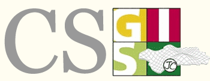

GeoLadris existe debido a los esfuerzos de personas como vosotros.

Hay muchas maneras en las que puede ayudar con el proyecto GeoLadris. GeoLadris abarca completamente un modelo de desarrollo de código abierto en la que cualquiera puede participar mediante aportaciones de código, detección de errores, traducción documentación o lo que se os ocurra.

## Lista de correo

* [Desarrollo](https://groups.google.com/forum/#!forum/geoladris)

## Reportar errores

> TODO: Issues y tags en Github

## Formateo del código

Se utiliza el [estilo](https://google.github.io/styleguide/javaguide.html) de Google para formatear el código Java.

Para el código JavaScript se utilizan unas reglas basadas en Airbnb ([ES5](https://www.npmjs.com/package/eslint-config-airbnb-es5)) con ligeras modificaciones. Es posible encontrar los ficheros `.eslintrc` en el repositorio con las definiciones para ejecutar con `eslint`.

## Contribuir cambios

Para incluir correcciones o nuevas funcionalidades, en Geoladris utilizamos [pull requests](https://help.github.com/articles/about-pull-requests/).

## Soporte
Geoladris es software libre, tu puedes hacer uso de las [cuatros libertades del software libre](https://es.wikipedia.org/wiki/Definici%C3%B3n_de_Software_Libre) pero si quieres o necesitas soporte comercial, las organizaciones que se detallan a continuación han participado activamente en el desarrollo de Geoladris.

Ánimo, haz que tu organización también sea partícipe

