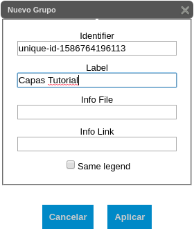
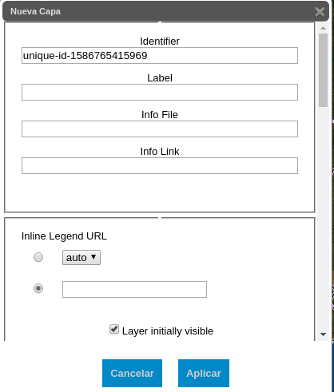

## Introducción

El árbol de capas del portal SNMB-Argentina se maneja desde el fichero `layers.json`. Por este motivo lo primero vamos a intentar explicar algunos conceptos para manejar este tipo de archivos.

Un fichero JSON es un conjunto de pares propiedad-valor. Tanto la propiedad como el valor van entre comillas dobles (" "), con dos puntos (:) entre los dos y, cada par, separados por comas. El conjunto tiene que ir dentro de llaves ({ }). Por ejemplo:

```json
{ "propiedad1": "valor1", "propiedad2": "valor2", ... }
```

Un array se asemeja al concepto matemático de vector. Representan valores múltiples para una misma propiedad. Los valores también van entre comillas dobles y separados por comas, pero en este caso van dentro de corchetes ([ ]). Ejemplo:

```json
"propiedad": ["valor1", "valor2",...]
```

Los valores de una propiedad pueden a su vez ser un JSON. Ejemplo:

```json
{"propiedad1": [{"propiedad1.1": "valor1.1",
                "propiedad1.2": "valor1.2"}....]}
```

Más ejemplos del caso que nos ocupa serían

JSON básico:

```json
{"id": "unique-id-1520610491279",
 "type": "wms",
 "label": ""
}
```

JSON con valores únicos y múltiples (array):

```json
{
    "items": [
        "departamentos",
        "unique-id-1520344804542",
        "limitenacional"
        ],
        "id": "admin",
        "label": "Áreas administrativas"
}
```

Valores JSON:

```json
{"wmsLayers": [
        {
            "queryType": "wms",
            "baseUrl": "http://ide.siia.gov.ar/geosever/wms",
            "label": "DEM SRTM 500X500 V1",
            "visible": true,
            "imageFormat": "image/png8",
            "id": "dem",
            "wmsName": "siia:MOSAICO_ARGENTINA_500x500_V1",
            "legend": "dem.png"
        },
        {
            "id": "modis",
            "type": "wms",
            "label": "",
            "sourceLink": "",
            "sourceLabel": "",
            "visible": true,
            "baseUrl": "https://tiles.maps.eox.at/wms"
        }]
}
```

El fichero layers.json tiene cuatro propiedades principales, `default-server`, `wmsLayers`, `portalLayers` y `groups`.

Más abajo se entran en detalles de cada una de las propiedades, pero para una primera aproximación diremos que, salvo `default-server`, que define el servidor que se usará en caso de que las capas no incluyan URL propias, las demás se encargan del manejo de las capas y la distribución de las mismas en el árbol.

De abajo a arriba dentro de la distribución de las propiedades en el fichero, la propiedad `groups` especifica las etiquetas iniciales del árbol. En este caso serían `Áreas Administrativas`, `Regiones forestales`, `Áreas de bosque` etc. Asimismo especifican los subgrupos (p.ej. `Bosque Nativo` y `Bosque cultivado` dentro del grupo `Áreas de bosque`) y las capas que van dentro de cada grupo o subgrupo.
La propiedad `portalLayers` especifica lo que es visible al usuario, tanto las capas propiamente dichas como las leyendas.
En la propiedad `wmsLayers` van todas las capas, 
leyendas del portal, etc, sean visibles al usuario o no.

## Edición del arbol de capas usando el editor
El portal está preparado para la edición del arbol de capas mediante la herramienta de edición del mismo. Lo primero que necesitaremos para poder empezar con la edición es tener cuenta de usuario con permisos de edición. Mediante el login deberemos acceder con nuestras credenciales:


*Fig. 1. Dialogo de acceso con credenciales*

Una vez que estemos logueados con éxito veremos que nuestro arbol de capas tiene los controles necesarios para la edición:


*Fig. 2. Aparición de los controles de edición*

### Iconos de edición    

Los iconos de edición nos van a permitir desplegar los formularios para crear un grupo , añadir un subgrupo , crear una capa , eliminar una capa o un grupo  y editar un grupo o una capa 

### Grupos
Para crear un grupo nuevo, pulsaríamos sobre el botón nuevo grupo  y aparecerá el formulario de creación de grupo:


*Fig. 3. Formulario de nuevo grupo*

Los campos a cubrir están descritos en la referencia [Arbol de Capas](../dev/layers.md).

En este caso lo que haremos será definir un identificador de grupo y una etiqueta



*Fig. 4. Formulario de nuevo grupo cubierto*

Seguidamente pulsaremos sobre el botón `Aplicar` para guardar los cambios en el arbol de capas.

!!! note

    Los cambios no serán grabados en el portal hasta que no se pulse sobre el botón guardar que se encuentra en la barra de navegación. 
    
!!! warning

    Si antes de guardar se refresca el portal se perderán las ediciones realizadas


*Fig. 5. Nuevo grupo creado*

Para poder realizar cambios en un grupo ya creado hay que pulsar el icono de edición  que está situado en la misma linea que el nombre del grupo a editar.


*Fig. 6 Grupo con botones de eliminación, creación subgrupo, alta capa y edición grupo*

De esta manera se abriría el formulario de grupo que vimos en la creación de grupo, con todos los datos del grupo que editamos, donde realizaríamos las modificaciones necesarias.

De la misma manera que cuando creamos un grupo, habría que pulsar el botón `Apply` y el botón `Guardar` de la barra de herramientas antes de refrescar el portal.

Para eliminar un grupo hay que pulsar el botón de eliminar  que está en la misma línea del grupo a eliminar. En este caso,al no desplegarse ningún formulario, no existe el botón `Apply`, por lo que se eliminaría el grupo directamente. Lo que si hay que pulsar es el botón `Guardar` antes de refrescar el portal para no perder las modificaciones.

### Subgrupos

Para crear un subgrupo hay que pulsar el icono  en la línea del grupo en el que queremos incluirlo. Al pulsar se abre el formulario de creación de subgrupo


*Fig. 7 Formulario de creación de subgrupo*

En el formulario hay que definir un identificador y una etiqueta al nuevo subgrupo. Aparece un identificador por defecto que puede ser modificado


*Fig. 8 Nuevo subgrupo creado

Como en los casos anteriores, hay que pulsar el botón `Apply` y el botón `Guardar` antes de refrescar el portal para que se guarden los cambios.

Una vez creado el subgrupo ya se pueden añadir las capas correspondientes de la forma que se explica en el apartado siguiente.

Cuando se crea un subgrupo desde grupo, se sitúa en la parte de abajo del grupo. Si se crea desde el botón de la línea del subgrupo, se sitúa a continuación del mismo.


*Fig. 9 Subgrupos creados desde grupo y desde subgrupo

De todas formas, los subgrupos, al igual que las capas, se pueden mover de sitio pinchando y arrastrando, pero sólo dentro del grupo donde se creó, es decir, no se puede cambiar de grupo.


*Fig. 10 Mover subgrupo


### Capas
Una nueva capa se puede crear dentro de un grupo o dentro de un subgrupo. Para hacerlo hay que pulsar el botón de crear capa . Si se pulsa el botón que está en la linea de un grupo se añadiría la capa dentro de ese grupo. Ver Fig. 6.

Si se pulsara en la línea de un subgrupo se añadiría en el subgrupo.


*Fig 11. Subgrupo con los botones de eliminación, creación y edición*


Al pulsar se abriría el formulario de creación de una capa, donde, como en el caso de creación de un grupo, tendríamos que definir un identificador de la capa y una etiqueta para la misma.
Las propiedades a cubrir están descritos en la referencia [Árbol de Capas](../dev/layers.md).



*Fig. 12. Formulario de nueva capa*

Para realizar modificaciones en una capa ya creada hay que pulsar el icono de edición  que se encuentra en la misma linea que la capa que queremos modificar. Al pulsar en el icono se abrirá el mismo formulario que para la creación de una nueva capa, pero con las propiedades de la capa a modificar, lo que nos permitirá cambiar las que precisemos.


*Fig. 13. Capa con botón de edición*

Tanto en la adición de una nueva capa como en la modificación de una existente, tenemos que pulsar el botón `Apply` y el botón `Guardar` antes de refrescar el portal, tal y como se indicó anteriormente.

Para eliminar una capa simplemente hay que pulsar el botón de eliminar  que está en la misma linea que la capa a eliminar. En este caso se elimina directamente sin necesidad de pulsar el botón `Apply`, de hecho no existe en este caso, pero si, insistimos, hay que pulsar `Guardar` como en los casos anteriores.

Tal y como se comentó en el apartado de subgrupos, las capas se pueden mover, pinchando y arrastrando,  dentro del grupo o subgrupo al que pertenecen.


*Fig. 14 Mover capa*

### Orden de las capas en el árbol

El orden de las capas es importante a la hora de que el dibujado del mapa se vea correctamente. Para modificar el orden de las capas hay que pulsar el botón `Orden Capas` de la barra de navegación.


*Fig. 15. Botón orden de capas*

Al pulsarlo se abre un formulario con las capas por orden de abajo a arriba.


*Fig. 16. Formulario de orden de capas*

Para modificar el orden simplemente hay que pinchar y arrastrar la capa al sitio nuevo que queramos. Recalcamos la importancia del orden. Las primeras capas de esta lista son las que se pintan más abajo, por lo que en este caso, es importante que las primeras de la lista sean las capas base para que las demás capas se pinten encima.


*Fig. 17. Orden de capas modificado. Movida la capa `Selva Paranaense(2002)`*

Una vez ordenadas las capas simplemente hay que pulsar el botón `Guardar` de la barra de navegación para persistir los cambios.


## Edición directa del archivo layers.json
Una manera de poder editar el arbol de capas es mediante la edición directa del archivo `layers.json`

### Incorporación de una nueva capa
Para incorporar una nueva capa hay que añadir un nuevo elemento JSON en el array de la propiedad `wms-layer`. Es muy importante la posición donde se inserta el nuevo elemento, ya que el orden de los elementos en el array definen el orden de las capas en el dibujado del mapa. En este caso, por ejemplo, las capas base deben ser las primeras para que las demás capas se pinten encima.

Una vez insertada en `wms-layer` hay que insertarla a su vez en `portalLayers`, de la misma manera que el paso anterior. Únicamente indicar que en esta propiedad no importa el orden.

La nueva capa insertada va a seguir el formato json, recordamos, pares propiedad-valor, tanto en `wms-layer` como en `portalLayers`. Las propiedades que lleva cada una se describen en el fichero [layers.md](../dev/layers.md). Ejemplos:

```json
{
    "wmsLayers": [
        {
            "id": "unique-id-1520344804542",
            "type": "wms",
            "legend": "auto",
            "label": "",
            "sourceLink": "",
            "sourceLabel": "",
            "visible": true,
            "baseUrl": "http://geo.ambiente.gob.ar/geoserver/ows",
            "wmsName": "bosques:provincias",
            .
            .
            .
        }]
}
```

```json
{"portalLayers": [
        {
             "layers": [
                "unique-id-1520344804542"
            ],
            "id": "unique-id-1520344804542",
            "label": "Límites provinciales",
            "infoFile": "ign.html",
            "infoLink": "",
            "inlineLegendUrl": "auto",
            .
            .
            .            
        }]
}
```

### Incorporación de un grupo
El procedimiento es el mismo que el explicado para la incorporación de capas, añadiendo la/s capa/s en la propiedad `groups`. Aquí vuelve a ser importante el orden de inserción del elemento ya que determina el orden de las etiquetas en el árbol. Simplemente sería añadir un nuevo JSON con una propiedad `items`, que es un array, los `id` de las capas que queremos que pertenezcan al grupo. Además hay que añadir las propiedades que se describen en el fichero [layers.md](../dev/layers.md), con habíamos comentado anteriormente. Por ejemplo:

```json
    "groups": [
        {
            "items": [
                "departamentos",
                "unique-id-1520344804542",
                "limitenacional"
            ],
            "id": "admin",
            "label": "Áreas administrativas"
        },
        .
        .
        .
]
```

### Incorporación de un subgrupo
Un subgrupo se incorpora dentro de un grupo. En la propiedad `items` del grupo, insertariamos el subgrupo de la misma forma que se inserta un grupo.

```json
"groups": [
        {
            "items": [
                {
                    "items": [
                        "selvamis_t",
                        "stb_t",
                        "pchbn06_3857",
                        "bap",
                        "espnan06",
                        "espcal06",
                        "mon98"
                    ],
                    "id": "innerbosquenativo",
                    "label": "Bosque Nativo"
                },
                {
                    "items": [
                        "unique-id-1521076972517",
                        "unique-id-1521077123304"
                    ],
                    "id": "innerbosquescultivados",
                    "label": "Bosque cultivado",
                    "infoFile": "",
                    "infoLink": ""
                }
            ],
            "id": "area_bosques",
            "infoFile": "bn_pc.docx.html",
            "label": "Áreas de bosque",
            "infoLink": ""
        }
        .
        .
        .
]
```