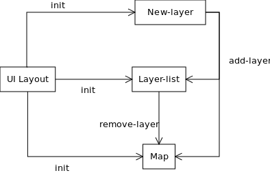

# Introducción

## ¿Qué es GeoLadris?

GeoLadris, es un framework para construir aplicaciones web modulares, basado en [RequireJS](http://requirejs.org/) y el patrón `message-bus` en el cliente, y en la especificación [Java Servlet 3.0](http://download.oracle.com/otndocs/jcp/servlet-3.0-fr-oth-JSpec/) en el servidor.

### Historia

[Geoladris](https://github.com/geoladris/) surge de la integración del portal de diseminación de datos forestales impulsado por FAO y los portales desarrollados por la empresa CSGIS ([aquí](http://demo-viewer.csgis.de/) puede verse una demo). Los desarrollos en ambos casos utilizan ahora un núcleo común, que es mantenido y mejorado por una comunidad ligeramente mayor.

Los beneficios para los usuarios de los portales FAO son a nivel de configuración, por ejemplo la posibilidad de configurar múltiples portales en una misma instancia de Tomcat, cada uno con su directorio de configuración. Pero en siguientes versiones habrá autenticación, configuración específica según el rol del usuario, migración a OpenLayers 3, etc. En resumen, más versatilidad y componentes más modernos.

En el futuro a corto plazo se seguirá trabajando en el crecimiento del proyecto. Para ello es necesario que la comunidad siga creciendo, por lo que tras la publicación de esta primera versión se pasará a estructurar el desarrollo de forma que:

- Sea público. Todas las decisiones se harán en [la lista preparada a tal efecto](https://groups.google.com/forum/#!forum/geoladris).
- Haya unas normas claras para la toma de decisiones. Creación de un comité de dirección abierto a nuevas incorporaciones.
- Sea posible y simple hacer alguna contribución al proyecto.

En definitiva, abrir el desarrollo para que Geoladris sea una alternativa tecnológica previsible y viable. 

### Apuesta tecnológica   

A nivel tecnológico, Geoladris permite agrupar todos los aspectos necesarios para implementar una funcionalidad determinada (módulos RequireJS, CSS, configuración, etc.) en el concepto de plugin.

Su funcionamiento es simple:

1. Para cada funcionalidad, existe un directorio con todos los componentes necesarios organizados de una manera precisa, que se explica más adelante.
2. El núcleo de Geoladris lee todos los elementos necesarios y los ofrece como una aplicación web: generando la carga de CSS en el HTML, generando la llamada para cargar todos los módulos RequireJS, etc.

El núcleo de Geoladris, en tanto que encargado de la gestión de plugins, ofrece además algunas funcionalidades extras como la habilitación y deshabilitación de plugins por configuración, la posibilidad de tener un directorio con la configuración de los plugins, etc. 

Y ya por encima del núcleo podemos encontrar algunos plugins básicos que ofrecen apoyo para la implementación de los plugins, como leer los parámetros de la URL, internacionalizar las cadenas de texto, comunicar con servicios externos, etc.

## La Arquitectura Cliente-Servidor
La arquitectura cliente-servidor es un modelo de aplicación distribuida en el que las tareas se reparten entre los proveedores de recursos o servicios, llamados servidores, y los demandantes, llamados clientes. Un cliente realiza peticiones a otro programa, el servidor, quien le da respuesta. Esta idea también se puede aplicar a programas que se ejecutan sobre una sola computadora, aunque es más ventajosa en un sistema operativo multiusuario distribuido a través de una red de computadoras. (Fuente: [Wikipedia](https://es.wikipedia.org/wiki/Cliente-servidor))

## Patrón de diseño `message-bus`

El patrón de diseño Message Bus permite desacoplar los componentes que forman una aplicación. En una aplicación modular, los distintos componentes necesitan interactuar entre sí. Si el acoplamiento es directo, la aplicación deja de ser modular ya que aparecen dependencias, con frecuencia recíprocas, entre los distintos módulos y no es posible realizar cambios a un módulo sin que otros se vean afectados.

En cambio, si los objetos se acoplan a través de un objeto intermediario (`Message Bus`), casi todas las dependencias desaparecen, dejando sólo aquellas que hay entre el `Message Bus` y los distintos módulos.

Para visualizar el patrón, propondremos un ejemplo, una aplicación modular que consta de tres componentes con representación gráfica y que están dispuestos de la siguiente manera:

* Map: En la parte central habrá un mapa.
* LayerList: En la parte izquierda habrá una lista de temas.
* NewLayer: En la parte superior existirá un control que permite añadir temas a los otros dos componentes.

Un posible diseño de dicha página consistiría en un módulo `Layout` que maqueta la página HTML y que inicializa los otros tres objetos. En respuesta a la acción del usuario, el objeto NewLayer mandaría un mensaje a LayerList y Map para añadir el tema en ambos componentes. De la misma manera, LayerList podría mandar un mensaje a Map en caso de que se permitiera la eliminación de capas desde aquél. El siguiente grafo muestra los mensajes que se pasarían los distintos objetos:

Es posible observar como en el caso de que se quisiera quitar el módulo LayerList, sería necesario modificar el objeto Layout así como el objeto NewLayer, ya que están directamente acoplados. Sin embargo, con el uso del Message Bus, sería posible hacer que los distintos objetos no se referenciaran entre sí directamente sino a través del Message Bus:

Así, el módulo NewLayer mandaría un mensaje al Message Bus con los datos de la nueva capa y Map y LayerList símplemente escucharían el mensaje y reaccionarían convenientemente. Sería trivial quitar de la página LayerList ya que no hay ninguna referencia directa al mismo (salvo tal vez en Layout).

Y al contrario: sería posible incluir un nuevo módulo, por ejemplo un mapa adicional, y que ambos escuchasen el evento “add-layer” de forma que se añadirían los temas a ambos mapas.

De esta manera la aplicación es totalmente modular: es posible reemplazar módulos sin que los otros módulos se vean afectados, se pueden realizar contribuciones bien definidas que sólo deben entender los mensajes existentes para poder integrarse en la aplicación, etc.

## Tecnologías usadas en GeoLadris

### Servidor
La parte servidora de *GeoLadris* está desarrollada mediante el uso de [Java](https://www.java.com).

### Cliente
La parte cliente de GeoLadris hace uso de las tecnologías habituales del desarrollo de aplicaciones web. Para su uso será necesario disponer de cualquiera de las versiones modernas de los navegadores actuales, Google Chrome, Internet Explorer, Firefox o Safari. Una vez instalado y configurado podremos acceder a nuestras aplicaciones haciendo uso de cualquiera de estos navegadores.
