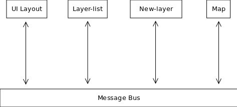

# Introducción

## ¿Qué es GeoLadris?

GeoLadris, es un framework para construir aplicaciones web modulares, basado en [RequireJS](http://requirejs.org/) y el patrón `message-bus` en el cliente, y en la especificación [Java Servlet 3.0](http://download.oracle.com/otndocs/jcp/servlet-3.0-fr-oth-JSpec/) en el servidor.

## La Arquitectura Cliente-Servidor
La arquitectura cliente-servidor es un modelo de aplicación distribuida en el que las tareas se reparten entre los proveedores de recursos o servicios, llamados servidores, y los demandantes, llamados clientes. Un cliente realiza peticiones a otro programa, el servidor, quien le da respuesta. Esta idea también se puede aplicar a programas que se ejecutan sobre una sola computadora, aunque es más ventajosa en un sistema operativo multiusuario distribuido a través de una red de computadoras. (Fuente: [Wikipedia](https://es.wikipedia.org/wiki/Cliente-servidor))

## Patrón de diseño `message-bus`

El patrón de diseño Message Bus permite desacoplar los componentes que forman una aplicación. En una aplicación modular, los distintos componentes necesitan interactuar entre sí. Si el acoplamiento es directo, la aplicación deja de ser modular ya que aparecen dependencias, con frecuencia recíprocas, entre los distintos módulos y no es posible realizar cambios a un módulo sin que otros se vean afectados.

En cambio, si los objetos se acoplan a través de un objeto intermediario (`Message Bus`), casi todas las dependencias desaparecen, dejando sólo aquellas que hay entre el `Message Bus` y los distintos módulos.

Para visualizar el patrón, propondremos un ejemplo, una aplicación modular que consta de tres componentes con representación gráfica y que están dispuestos de la siguiente manera:

* Map: En la parte central habrá un mapa.
* LayerList: En la parte izquierda habrá una lista de temas.
* NewLayer: En la parte superior existirá un control que permite añadir temas a los otros dos componentes.

Un posible diseño de dicha página consistiría en un módulo `Layout` que maqueta la página HTML y que inicializa los otros tres objetos. En respuesta a la acción del usuario, el objeto NewLayer mandaría un mensaje a LayerList y Map para añadir el tema en ambos componentes. De la misma manera, LayerList podría mandar un mensaje a Map en caso de que se permitiera la eliminación de capas desde aquél. El siguiente grafo muestra los mensajes que se pasarían los distintos objetos:

Es posible observar como en el caso de que se quisiera quitar el módulo LayerList, sería necesario modificar el objeto Layout así como el objeto NewLayer, ya que están directamente acoplados. Sin embargo, con el uso del Message Bus, sería posible hacer que los distintos objetos no se referenciaran entre sí directamente sino a través del Message Bus:

Así, el módulo NewLayer mandaría un mensaje al Message Bus con los datos de la nueva capa y Map y LayerList símplemente escucharían el mensaje y reaccionarían convenientemente. Sería trivial quitar de la página LayerList ya que no hay ninguna referencia directa al mismo (salvo tal vez en Layout).

Y al contrario: sería posible incluir un nuevo módulo, por ejemplo un mapa adicional, y que ambos escuchasen el evento “add-layer” de forma que se añadirían los temas a ambos mapas.

De esta manera la aplicación es totalmente modular: es posible reemplazar módulos sin que los otros módulos se vean afectados, se pueden realizar contribuciones bien definidas que sólo deben entender los mensajes existentes para poder integrarse en la aplicación, etc.

## Tecnologías usadas en GeoLadris

### Servidor
La parte servidora de *GeoLadris* está desarrollada mediante el uso de [Java](https://www.java.com).

### Cliente
La parte cliente de GeoLadris hace uso de las tecnologías habituales del desarrollo de aplicaciones web. Para su uso será necesario disponer de cualquiera de las versiones modernas de los navegadores actuales, Google Chrome, Internet Explorer, Firefox o Safari. Una vez instalado y configurado podremos acceder a nuestras aplicaciones haciendo uso de cualquiera de estos navegadores.
