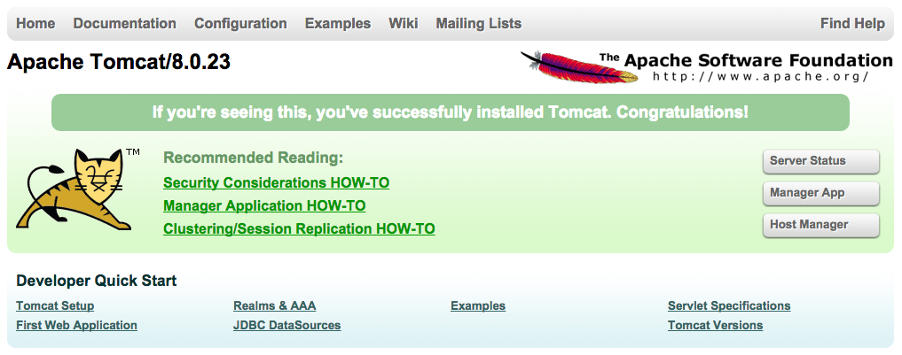

# Instalación

En esta parte de la documentación abordaremos el proceso de instalación de Geoladris. Como se ha comentado en la introducción, GeoLadris se compone de una arquitectura cliente-servidor. La primera parte de la instalación será la puesta en marcha del contenedor de aplicaciones donde desplegaremos nuestro servidor. Para ello utilizaremos el sotware Tomcat.

## Puesta en marcha de Tomcat

Tomcat es un contenedor de aplicaciones desarrollado en Java, por lo que esta deberá encontrarse instalada en el sistema.

La instalación  de Java puede realizarse siguiendo los pasos para el sistema operativo sobre el que se vaya a instalar ([¿Cómo puedo instalar Java?](https://www.java.com/es/download/help/download_options.xml)).

Una vez instalado Java podremos comprobar si esta se encuentra instalado mediante:

En entornos Linux:
```
$ java -version
java version "1.8.0_121"
Java(TM) SE Runtime Environment (build 1.8.0_121-b13)
Java HotSpot(TM) 64-Bit Server VM (build 25.121-b13, mixed mode)
```

En Windows:
```
C:\Users\username>java -version
java version "1.8.0_121"
Java(TM) SE Runtime Environment (build 1.8.0_121-b13)
Java HotSpot(TM) 64-Bit Server VM (build 25.121-b13, mixed mode)
```

GeoLadris necesitará de un contenedor de aplicaciones para su puesta en marcha como servidor. Para ello haremos uso de [Tomcat](http://tomcat.apache.org/).

Se deberá instalar Tomcat en la máquina servidora. Se realizará la instalación dependiendo del sistema operativo de la máquina siguiendo las instrucciones al respecto.

Una vez instalado Tomcat en la máquina comprobaremos que se encuentra corriendo en la misma accediendo desde un navegador a la URL [http://localhost:8080](http://localhost:8080), siendo está la dirección de instalación por defecto de Tomcat.

En esa URL deberemos ver la página de inicio de Tomcat:



## Instalación de GeoLadris
Antes de proceder con la instalación de GeoLadris recomendamos revisar la documentación sobre la [estructura del proyecto](structure_project.md).

Para tener disponible GeoLadris, haremos una instalación de la app [demo](https://github.com/geoladris/apps/tree/master/demo).

Deberemos tener instalado Tomcat como se ha comentado anteriormente en este mismo capítulo. Descargaremos la última vesrión disponible de GeoLadris. Para ello podremos acceder a la [sección de descargas del software](download.md).

Una vez descargado el archivo *demo-6.0.0.war*, renombraremos este archivo a *demo.war* y lo moveremos a la carpeta `$TOMCAT_HOME/webapps` de nuestra instalación de Tomcat.

<aside class="warning">
Dependiendo de la instalación que se haya realizado de Tomcat y del sistema operativo, podrá variar la ruta de la carpeta `webapps`
</aside>

Desde nuestro navegador, iremos a *http://localhost:8080/demo* para poder acceder a la demo del portal.
